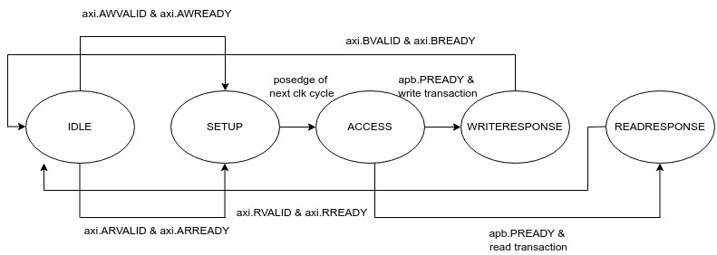
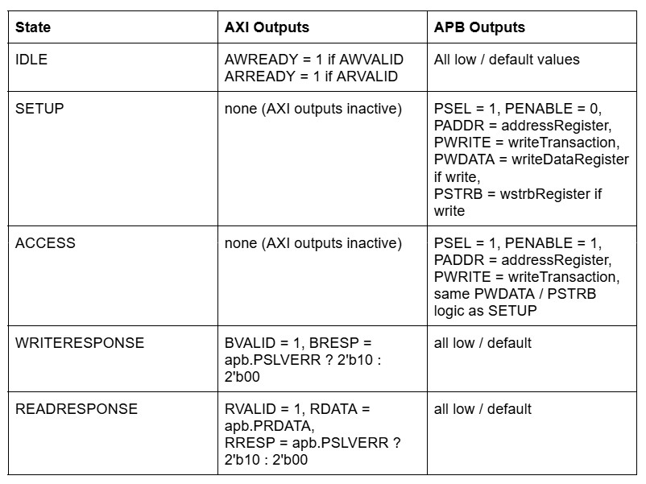
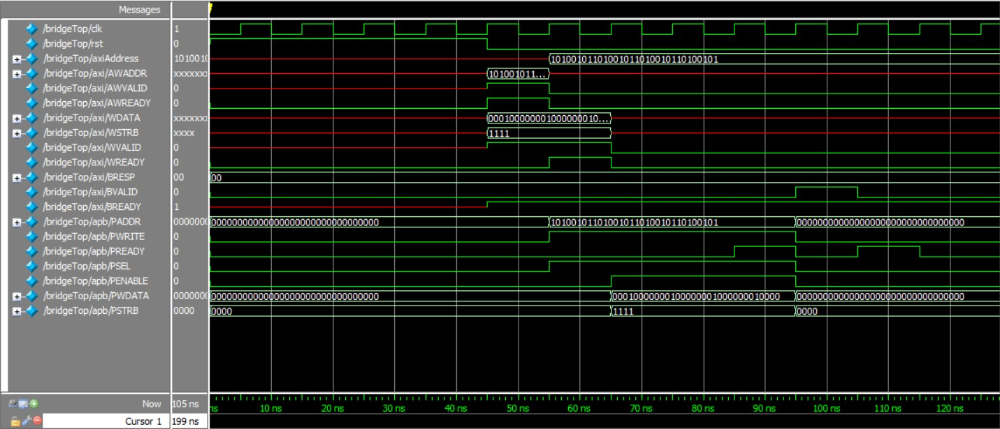
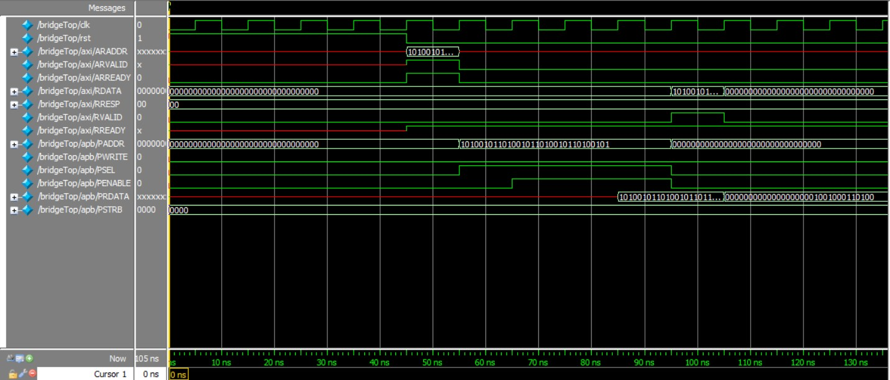

# *AXI4-Lite to APB3 Bridge*: Protocol Conversion and Simulation-Backed Design
_[Implemented in SystemVerilog + Functional Verification with Waveform Simulation via ModelSim + Behavioral Testing with Verilog Testbenches]_
<br>
_Developed by Sai Vura (ECE Student @ Purdue) as a Personal Project_
<br/>

## <u>Abstract / Introduction</u>
In modern SoC designs, it is important to implement efficient communication between high-performance and low-power components. This project implements a hardware bridge between two commonly used communication protocols: AXI4-Lite and APB3. The reason for choosing AXI4-Lite is because it is a simplified version of the AXI protocol that has been optimized for minimal latency and high speed transfer. Conversely, APB3 is designed for low-bandwidth, and low-power peripheral communication. Both are simplified subsets of their respective protocols that make use of their fundamental signals and instruction flow without advanced capabilities like out-of-order or burst transactions, making them the perfect choices for an academic project. To enable seamless data transfer between modules using these different protocols, a System-Verilog based bridge was developed and verified. 

My design includes custom interface definitions for both AXI4-Lite and APB3, a core bridging module that performs the protocol conversion, and a Verilog-based testbench for functional simulation. Verification was performed using ModelSim, through which waveform analysis confirmed the predicted behavior across read and write transactions.

## <u>Design Specifications</u>

### Protocol Assumptions
This bridge project assumes the use of the AXI4-Lite and APB3 protocols, both of which are simplified subsets of their full-featured counterparts. To streamline the design, the following assumptions were made:

- AXI4-Lite
    - Only single beat transfers are supported. Burst and lock features have not been implemented here but may be in an expanded future version.
    - ```AWPROT```, ```AWCACHE```, ```ARPROT```, and ```ARCACHE```  signals are not used here, as they are not critical for basic memory-mapped transactions.
    - Write strobes are supported to allow for byte-level granularity during write transactions. Since I assumed 32-bit data transfer, the write strobes were 4-bits wide.
    - Response channels are EXPLICITLY declared as ```OKAY``` or ```SLVERR``` in this current implementation. Error signaling may be expanded in the future.
    - Backpressure is respected on all handshakes across the five AXI channels.

- APB3 Protocol
    - A simplified model of APB3 is used with basic handshaking (```PSEL```, ```PENABLE```, ```PREADY```).
    - Address, write, and read data widths are fixed at 32 bits as per my research on common bit width.
- These assumptions simplify the bridge and make it suitable for simple peripheral interfacing in low-complexity systems and lay a good foundation for me to expand into more robust protocols in the future.

### Clocking / Reset Assumptions
- The system operates on a single clock domain, with all AXI and APB transactions synchronized to the same global clk signal. This simplifies the timing requirements and eliminates the need for CDC logic.

- Clock
    - A free running clock is modeled in the testbench with a 10 ns period (100 MHz), generated with a toggling ```always #5 clk = ~clk;``` process
    - All handshaking, state transitions, and signal updates are triggered on the rising edge of the clk.
    - Both protocols pay respect to the same system clock signal. Ideally, the APB3 devices would use a slower clock. That has not been respected in this project but can be implemented with simple RTL divider logic.

- Reset
    - An active high asynchronous reset is used to initialize the system.
    - The reset signal is asserted for a few cycles after the simulation begins and is then deasserted.
    - Modules are expected to initialize their outputs to known default values on the reset. 

- These assumptions were reflected in the Verilog testbench and verified through waveform simulations to ensure correct behavior and protocol timing under a single clock domain.


## <u>Implementation Details </u>
### Description of Key Modules
- ```coreBridge.sv```
    - This module is the central component responsible for translating AXI4-Lite transactions into equivalent APB3 protocol sequences. It monitors all five AXI channels (read address, read data, write address, write data, and write response) and responds appropriately using simple internal control logic.
    - Top-Level I/O:
        - clk, rst: system clock and asynchronous reset
        - axi: slave AXI interface using a modport
        - apb: master APB interface using a modport
    - Internal FSM:
        - States:
            - **IDLE**: waiting for a read or write request
            - **SETUP**: start the APB transaction
            - **ACCESS**: complete the APB transaction
            - **WRITERESPONSE**: send response back to AXI after write
            - **READRESPONSE**: send response and data back to AXI after read
        - Transitions: Based on AXI handshakes and APB readiness status
            - From ```IDLE``` to ```SETUP``` on a new request, then progress to ```ACCESS```, and then the appropriate response state from there.
    - Key Internal Signals:
        - ```addressRegister```: hold the address of peripheral for transaction
        - ```writeDataRegister```: hold the data to write
        - ```wstrbRegister```: holds the byte-level write strobes
        - ```writeTransaction```: a flag that indicates whether the current transaction is a write or a read
    - FSM Output Logic:
        - Based on the current state, appropriate AXI and APB signals are asserted/deasserted.
        - All outputs are given safe default values to avoid unintended latching or floating values.
        - APB control signals driven only in the ```SETUP``` and ```ACCESS``` states.
        - Write response (```BRESP```, ```BVALID```) and read response (```RDATA```, ```RRESP```, ```RVALID```) are returned during their respective states.
    - Registering Inputs:
        - Address and type of transaction (read/write) are latched during the ```IDLE``` state when valid handshakes occur.
        - Write data and strobes are captured when ```WVALID``` and ```WREADY``` are both asserted, even when outside of the ```IDLE``` state


- ```axiInterface.sv```
    - A dedicated SystemVerilog interface that encapsulates AXI4-Lite signals. Using an interface provides several advantages:
        - Simplifies port connections by bundling related signals together
        - Improves readability and modularity of the top-level and testbench code
        - Allows consistent signal naming and easier expansion in the future
        - The modports allow for usability of this protocol as either a master or slave device depending on features to implement
- ```apbInterface.sv```
    - A dedicated SystemVerilog interface that encapsulates APB3 signals. Using an interface provides several advantages:
        - Simplifies port connections by bundling related signals together
        - Improves readability and modularity of the top-level and testbench code
        - Allows consistent signal naming and easier expansion in the future
        - The modports allow for usability of this protocol as either a master or slave device depending on features to implement
- ```bridgeTop.sv```
    - Serves as the top-level testbench for simulation and verification. It provides a simple testing environment that generates AXI transactions, emulates appropriate APB peripheral behavior, and monitors the signal values with assertions, timeouts, and debug print messages.

### State Machine for FSM
- The following is a state machine diagram for the state transtion FSM logic.


### State Output Diagram
- The following is a diagram that breaks down the FSM output logic.
<br>


## <u>Verification Methodology</u>
- The ```bridgeTop.sv``` module is responsible for verification and debugging. Key components and features of the module include:
    - Clock + Reset Generation:
        - A 100 MHz ```clk``` is generated using a toggling always block. An asynchronous reset (```rst```) is applied for five cycles at the beginning of simulation using an initial block. This allows for all peripherals to be properly initialized and set up.
    - Interface Instantiations:
        - AXI and APB System-Verilog interfaces are instantiated as axi and apb, respectively. These interfaces are connected to the DUT (```coreBridge```) using the appropriate modports (```axi.slave``` and ```apb.master```), which simplifies the port management and signal naming conventions.
    - DUT Instantiation:
        - The ```coreBridge``` module is instantiated as ```testBridge```, connecting to the interface signals and ```clk``` / ```rst```. This isolates protocol translation logic for more simplified testing.
    - Dummy APB Slave Model:
        - An initial block continuously acts an APB slave. It waits for the ```PSEL``` and ```PENABLE``` signals to be asserted, then asserts ```PREADY``` and provides fixed read data (```0x10101010```). This allows controlled and predictable APB responses during testing without needing a real hardware peripheral.
    - AXI Transaction Tasks:
        - Two task blocks, ```axiWrite()``` and ```axiRead()```, simulate master-driven AXI operations.
        - Each task drives the appropriate AXI address and data channels, waits for the corresponding handshakes (```AWREADY```, ```WREADY```, ```ARREADY```, ```RVALID```, etc.), and logs the result.
        - Fork-join blocks implement timeouts of 500 ns, printing debug information and avoiding deadlock in case of any errors or bugs.
        - Additional logic captures and displays write response (```BRESP```) or read value (```RDATA```) for validation.
    - State Monitoring and Debugging:
        - State transitions from ```coreBridge``` are monitored and printed during timeouts to help diagnose incorrect behavior. The current AXI address is stored in a register (```axiAddress```) for better debug visibility.
    - Test Sequence Execution:
        - A ```testSequence()``` task runs a full transaction sequence by calling the ```axiWrite()``` and ```axiRead()``` tasks: one AXI write followed by an AXI read. The written address (```0xA5A5A5A5```) and data (```0x10101010```) are verified through APB logging and readback.
- APB Transaction Logging:
    - An always block on the APB clock edge prints a message whenever a valid read or write occurs, including address, data, and the specified byte strobe. This provides real-time visibility into the bridge’s output behavior.


- To run verification of the bridge design, waveform simulation was performed using ModelSim. To automate this process, a ```run.do``` script was used.
    - This file contains TCL commands. Explanation:
        - ```vlib work```: creates a new simulation library called "work."
        - ```vmap work work```: maps the library name to the physical directory.
        - ```vlog -sv -novopt \ ... ```: compiles all SV files and disables optimization. The files are compiled in the proper order. Changing the order will result in dependency issues.
        - ```vsim -novopt -t 1ns bridgeTop```: launches the simulation for the ```bridgeTop``` module with a 1 ns timescale.
        - ```add wave -position insertpoint sim:/bridgeTop/*```: adds all signals from the module to the waveform.
        - ```run -all```: runs the simulation until it reaches a stopping point.
        - ```wave zoom full```: adjusts the waveform viewer to display the entire window.


## <u>Sample Results</u>
- The shown waveforms are resultants of the following sample test cases.
    - Write transaction
        - Address: ```32'hA5A5A5A5```
        - Data: ```32'h10101010```
        - Write strobe: ```4'b1111```
            - 

    - Read transaction
        - Address: ```32'hA5A5A5A5```
        - _Dummy value of ```32'hA5A5B7D9``` placed into that address for testing_
            - 